# 仮想化

---

<!-- 
  _header: '仮想化'
-->

- ハイパーバイザ型
- コンテナ型

---

<!-- 
  _header: 'ハイパーバイザ型'
-->

- Type1
    - (ネイティブ|ベアメタル)型ハイパーバイザ
- Type2
    - ホスト型ハイパーバイザ

---
<!--
  _header: ベアメタル型ハイパーバイザ
-->

---
<!--
  _header: ベアメタル型ハイパーバイザ
-->

- Xen
- ESXi
- Hyper-V
- KVM

---
<!--
  _header: ホスト型ハイパーバイザ
-->

---
<!--
  _header: ホスト型ハイパーバイザ
-->

- メリット
    - 手軽
- デメリット
    - 遅い
    - リソースを食う

---
<!--
  _header: ホスト型ハイパーバイザ
-->

- Parallels Workstation,Parallels Desktop
- VirtualBox
- VMware Workstation, VMware Fusion
- QEMU

---

## 完全仮想化,準仮想化

---
<!--
  _header: 完全仮想化
-->

- ゲストOSを修正することなく、そのまま実行させる仮想化方式
- ハードウェアをエミュレートするためオーバヘッドが大きい
- HAV対応のプロセッサでないと使えない

---
<!--
  _header: 準仮想化
-->

- ゲストOSには準仮想化用の修正を施したもののみ使用できる仮想化方式
    - VirtIO
- ハイパーバイザが直接操作するためオーバヘッドが小さい

---

## 仮想化支援技術
---

<!--
  _header: 仮想化支援技術
-->

- Intel VT-x/EPT
- AMD-V/RVI

---

<!--
  _header: 仮想化支援技術
-->

参考リンク: https://ja.wikipedia.org/wiki/%E3%82%A4%E3%83%B3%E3%83%86%E3%83%AB_%E3%83%90%E3%83%BC%E3%83%81%E3%83%A3%E3%83%A9%E3%82%A4%E3%82%BC%E3%83%BC%E3%82%B7%E3%83%A7%E3%83%B3%E3%83%BB%E3%83%86%E3%82%AF%E3%83%8E%E3%83%AD%E3%82%B8%E3%83%BC

---

## ネストされた仮想化

---

参考リンク: https://www.os-museum.com/nestedvirtualization/nestedvirtualization.htm

---

## KVM

---
<!--
  _header: KVM
-->

- Linux カーネルに搭載されているハイパーバイザ
- プロセッサがハードウェア仮想化をサポートしている必要あり
- 準仮想化をサポート(Linuxは標準で対応,Windowsは別途ドライバのインストール必要)
- QEMUと組み合わせて使う
- さくらのクラウド, GCP, AWS、などで使われている
- 参考リンク
    - https://www.designet.co.jp/faq/term/?id=S1ZN
    - https://wiki.archlinux.jp/index.php/KVM
    - https://ja.wikipedia.org/wiki/Kernel-based_Virtual_Machine

---

## Xen

---
<!--
  _header: Xen
-->

- Linux カーネルに搭載されているハイパーバイザ
- 完全仮想化をするにはプロセッサがハードウェア仮想化をサポートしている必要あり
- 準仮想化に標準で対応(ゲストOSの修正の必要あり)
- AWSなどで使われている
- 参考リンク
    - https://wiki.archlinux.jp/index.php/Xen
    - https://ja.wikipedia.org/wiki/Xen_(%E4%BB%AE%E6%83%B3%E5%8C%96%E3%82%BD%E3%83%95%E3%83%88%E3%82%A6%E3%82%A7%E3%82%A2)

---

## OpenVZ

---
<!--
    _header: OpenVZ
-->

- Parallels Virtuozzo Containersのオープンソース版
- ゲストはLinuxのみサポート
- プロセッサがハードウェア仮想化をサポートしている必要はない
- コンテナ型、ハイパーバイザ型の複合
    - リソース効率がいい
    - ゲストOSの機能制限が強め
- 参考リンク
    - https://ja.wikipedia.org/wiki/OpenVZ
    - https://wiki.openvz.org/Main_Page

---

## VMware

---
<!--
    _header: VMware
-->

- 参考リンク
    - https://ja.wikipedia.org/wiki/VMware 
    - https://www.vmware.com/jp/products.html
    - https://10.255.3.40/ui/#/login
---

## VirtualBox

---
<!--
    _header: VirtualBox
-->
- ホストはさまざまなOSに対応(Linux, macOS, Windows, その他Unix系OSなど)
    - Type2のハイパーバイザ
    - M1だと動かない
- プロセッサがハードウェア仮想化をサポートしている必要はない
- 開発環境用として最適
- GPL
- 参考リンク
    - https://ja.wikipedia.org/wiki/VirtualBox

---

## QEMU

---
<!--
    _header: QEMU
-->
- 単体だとパフォーマンスが悪いのでKVMと組み合わせて使う
- Docker Desktop for Mac や Android Emulator などで利用されている
    - https://docs.docker.com/desktop/mac/release-notes/
    - https://developer.android.com/studio/run/emulator-commandline?hl=ja
- https://ja.wikipedia.org/wiki/QEMU
- https://endy-tech.hatenablog.jp/entry/kvm_introduction#KVM--QEMU%E3%81%AE%E3%82%A2%E3%82%AF%E3%82%BB%E3%83%A9%E3%83%AC%E3%83%BC%E3%82%BF
